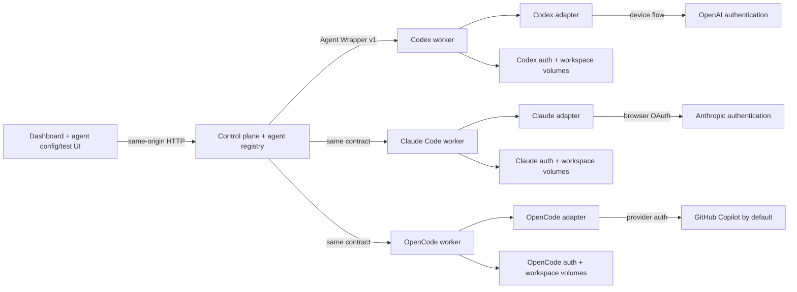

# Agent Dock: containerized subscription-agent POC

This proof of concept registers independently configured agents in a small control plane and connects each one to a vendor-neutral worker API. The included Docker stack runs separate Codex CLI, Claude Code, and multi-provider OpenCode identities in isolated worker containers. Each container installs its CLI on first boot, keeps its own CLI-managed authentication volume, and translates provider output into the versioned Agent Wrapper event protocol.

It is meant to validate the architecture—not to automate subscription creation, rotate accounts, resell access, or hide provider usage limits.

## Run it

Requirements: Docker Desktop (or Docker Engine with Compose) and an eligible Codex and/or Claude Code subscription.

```bash
cp .env.example .env
# Set a long random WORKER_TOKEN in .env.
docker compose up --build
```

Open [http://localhost:3000](http://localhost:3000). **Codex Worker 01** uses OpenAI's device flow. Create a Claude Code agent from the dashboard to pair it with the included Claude worker, then use **Start browser login**. Claude Code may return a one-time authorization code after browser sign-in; Agent Dock forwards that code to the waiting CLI process without logging or persisting it. Create an OpenCode agent to pair it with the third worker; this POC defaults OpenCode authentication to the officially supported GitHub Copilot device flow and automatically selects public GitHub.com before surfacing the provider URL/code. Nothing in this repository asks for or accepts a provider password, session cookie, API key, or stored OAuth token.

If port 3000 is already occupied, set `CONTROL_PLANE_PORT` in `.env` before starting Compose—for example, `CONTROL_PLANE_PORT=3080` makes the UI available at `http://localhost:3080`.

The first boot can take a minute because each worker installs its CLI at runtime. The `codex-bin`, `claude-bin`, and `opencode-bin` volumes cache those installations; their matching auth volumes retain independent CLI-managed logins across restarts. The `control-data` volume stores agent records and durable prompts. Set `CODEX_VERSION`, `CLAUDE_VERSION`, or `OPENCODE_VERSION` in `.env` to pin a release.

The worker image includes the operating-system CA certificate bundle required by the Codex CLI for TLS connections during device authentication.

Codex artifacts appear in [`workspace/`](./workspace), Claude artifacts in [`claude-workspace/`](./claude-workspace), and OpenCode artifacts in [`opencode-workspace/`](./opencode-workspace).

## What the POC proves



- The web tier never needs the Docker socket or provider credentials.
- The fleet dashboard supports create, read, update, and delete for agent records, then reports each reachable runtime's auth, activity, usage, and request count.
- Fleet and agent runtime status refresh every three seconds while the browser tab is visible, with overlapping requests deduplicated.
- Each agent has a durable prompt stored by the control plane and a separate, intentionally ephemeral test conversation.
- The agent workspace puts live runtime, authentication, and usage data in its header, with separate Instructions, Tools & MCP, Data, and Test areas.
- Worker endpoints and bearer tokens are server-side connection details and are never returned in agent API responses or rendered in the browser.
- The browser cannot override durable instructions per request; the control plane injects the saved prompt when it dispatches a task.
- A worker can be local or remote as long as the control plane can reach its HTTP endpoint.
- Device authentication is initiated by the unmodified Codex CLI and surfaced as a URL/code.
- The card shows safe session metadata, including access-token expiry and last refresh time, without returning credentials to the control plane.
- A user can force Codex's supported managed-session refresh through app-server; this does not run a model turn.
- The adapters convert `codex exec --json`, `claude -p --output-format stream-json`, and `opencode run --format json` output into canonical, vendor-neutral task events.
- The agent can create durable artifacts in its isolated workspace.
- Each completed request records input, cached-input, output, total-token, duration, and outcome metrics in the `agent-data` volume.
- The Codex worker polls app-server after each request for subscription quota windows and account token-activity summaries.
- Claude Code exposes per-request token telemetry in its stream but no supported subscription quota-window endpoint, so that adapter reports quota/account capabilities as unavailable rather than inventing data.
- OpenCode exposes per-request token/cost events but account quotas remain provider-specific, so the adapter advertises request telemetry without inventing account windows. OpenCode is a multi-provider harness; it does not itself supply subsidized tokens.
- The control plane depends only on the versioned wrapper contract; both provider workers use the same UI and API surface.

The complete system model is available as [Markdown](./docs/architecture.md), [editable Mermaid](./docs/architecture.mmd), and a [standalone SVG](./docs/architecture.svg). The provider boundary is documented in [`docs/adapter-contract.md`](./docs/adapter-contract.md).

## API

The control plane exposes fleet CRUD plus a consistent set of runtime operations scoped by agent ID:

| Method | Route | Purpose |
|---|---|---|
| `GET` | `/api/v1/health` | Control-plane and worker reachability |
| `GET`, `POST` | `/api/v1/agents` | List or create agent records |
| `GET`, `PATCH`, `DELETE` | `/api/v1/agents/:id` | Read, edit, or delete one agent record |
| `GET` | `/api/v1/agents/:id/status` | Adapter, capability, auth, task, execution, and usage status |
| `POST` | `/api/v1/agents/:id/auth/login` | Start the adapter's interactive login flow |
| `POST` | `/api/v1/agents/:id/auth/complete` | Forward a provider-issued one-time browser authorization code to a waiting CLI |
| `POST` | `/api/v1/agents/:id/auth/refresh` | Ask the adapter to refresh its managed session |
| `POST` | `/api/v1/agents/:id/tasks` | Run `{ "prompt": "..." }` with saved durable instructions; returns canonical NDJSON |
| `POST` | `/api/v1/agents/:id/tasks/cancel` | Cancel the active task |
| `GET` | `/api/v1/agents/:id/workspace` | List worker artifacts (not their contents) |
| `GET` | `/api/v1/agents/:id/usage` | Read normalized request history, totals, quota windows, and account activity |
| `POST` | `/api/v1/agents/:id/usage/refresh` | Ask the adapter to refresh its available usage sources |

The original unscoped runtime routes remain aliases for the default agent during the POC.

Example without the UI:

```bash
curl -N http://localhost:3000/api/v1/agents/worker-01/tasks \
  -H 'content-type: application/json' \
  -d '{"prompt":"Create /workspace/hello.txt with a short greeting."}'
```

## Security boundary and limitations

The worker invokes `codex exec --dangerously-bypass-approvals-and-sandbox` by default because the Docker container is the POC's non-interactive execution boundary. The agent can modify the bind-mounted `workspace/`, run processes inside the worker, and use the worker's network. Do not mount source, SSH keys, cloud credentials, the Docker socket, or sensitive host paths into it. Set `ALLOW_UNSANDBOXED=0` to use Codex's `workspace-write` sandbox instead, understanding that unattended tool execution may be more constrained.

The included Compose file provisions one Codex worker, one Claude Code worker, and one OpenCode worker. Creating a built-in runtime type pairs the agent record to that provider's server-side worker template, but it does not yet create an additional container or volume set per new record. General automated provisioning, one-time remote-worker pairing, MCP installation, and arbitrary data mounts remain distinct next capabilities. The Tools & MCP and Data tabs establish those future management surfaces without presenting nonfunctional credential or mount controls.

This prototype deliberately omits multi-tenancy, scheduling, webhooks, queue durability, usage-limit routing, TLS, user authentication for the web UI, remote secret management, egress controls, and container resource limits. The control-plane registry is currently a single JSON file and the browser is vanilla JavaScript; SQLite/Postgres-ready persistence and a React/TypeScript frontend are tracked architectural follow-ons. Usage telemetry and agent configuration are durable; jobs, event streams, and test conversations are not.

The control plane does not inspect or copy provider credentials, but the Docker host administrator can technically inspect container volumes. The CLI needs its auth volume to remain writable so refreshed tokens can be persisted. The control plane's worker bearer token is transport authentication—not a provider credential—and is stored in the server-side registry for this POC. Give each independently authenticated worker its own auth volume and do not mount one `auth.json` into concurrent workers. For remote deployment, put the UI behind real authentication and TLS, replace stored bearer tokens with secret-manager references or pairing credentials, constrain network egress, run rootless containers, pin the CLI version and base image digest, and add CPU/memory/PID limits.

Users and operators remain responsible for complying with applicable OpenAI terms and account rules. This project does not implement automatic account rollover or subscription provisioning.

## Development and test

The application has no third-party JavaScript dependencies. Run the contract test with:

```bash
npm test
```

To exercise the complete UI without authenticating or spending subscription usage, start the deterministic demo worker:

```bash
npm run demo
```

For UI-only work against a separately running worker:

```bash
WORKER_TOKEN=... WORKER_URL=http://127.0.0.1:7777 npm run dev
```
