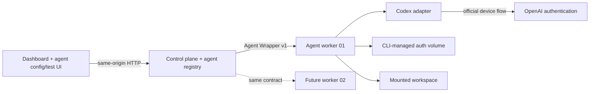

# Agent Dock: containerized Codex POC

This proof of concept registers independently configured agents in a small control plane and connects each one to a vendor-neutral worker API. The included Docker stack runs one official Codex CLI identity inside one worker container. That container installs `@openai/codex` itself on first boot, the user completes OpenAI's device login directly, and the Codex adapter translates provider output into the versioned Agent Wrapper event protocol.

It is meant to validate the architecture—not to automate subscription creation, rotate accounts, resell access, or hide provider usage limits.

## Run it

Requirements: Docker Desktop (or Docker Engine with Compose) and an eligible Codex subscription.

```bash
cp .env.example .env
# Set a long random WORKER_TOKEN in .env.
docker compose up --build
```

Open [http://localhost:3000](http://localhost:3000), open **Codex Worker 01**, select **Start device login**, and complete authentication on the OpenAI page. Nothing in this repository asks for or accepts an OpenAI password, session cookie, API key, or OAuth token.

If port 3000 is already occupied, set `CONTROL_PLANE_PORT` in `.env` before starting Compose—for example, `CONTROL_PLANE_PORT=3080` makes the UI available at `http://localhost:3080`.

The first boot can take a minute because the worker installs the official CLI at runtime. The `codex-bin` volume caches that installation; `codex-auth` retains the CLI-managed login across restarts. The `control-data` volume stores agent records and their durable prompts. Set `CODEX_VERSION` in `.env` to pin or change the installed release.

The worker image includes the operating-system CA certificate bundle required by the Codex CLI for TLS connections during device authentication.

Files the agent creates appear in [`workspace/`](./workspace) on the host.

## What the POC proves



- The web tier never needs the Docker socket or provider credentials.
- The fleet dashboard supports create, read, update, and delete for agent records, then reports each reachable runtime's auth, activity, usage, and request count.
- Each agent has a durable prompt stored by the control plane and a separate, intentionally ephemeral test conversation.
- The browser cannot override durable instructions per request; the control plane injects the saved prompt when it dispatches a task.
- A worker can be local or remote as long as the control plane can reach its HTTP endpoint.
- Device authentication is initiated by the unmodified Codex CLI and surfaced as a URL/code.
- The card shows safe session metadata, including access-token expiry and last refresh time, without returning credentials to the control plane.
- A user can force Codex's supported managed-session refresh through app-server; this does not run a model turn.
- The adapter converts `codex exec --json` output into canonical, vendor-neutral task events.
- The agent can create durable artifacts in its isolated workspace.
- Each completed request records input, cached-input, output, total-token, duration, and outcome metrics in the `agent-data` volume.
- The worker polls Codex app-server after each request for subscription quota windows and account token-activity summaries.
- The control plane depends only on the versioned wrapper contract; a Claude adapter can implement the same surface without UI changes.

The complete provider-adapter boundary is documented in [`docs/adapter-contract.md`](./docs/adapter-contract.md).

## API

The control plane exposes fleet CRUD plus a consistent set of runtime operations scoped by agent ID:

| Method | Route | Purpose |
|---|---|---|
| `GET` | `/api/v1/health` | Control-plane and worker reachability |
| `GET`, `POST` | `/api/v1/agents` | List or create agent records |
| `GET`, `PATCH`, `DELETE` | `/api/v1/agents/:id` | Read, edit, or delete one agent record |
| `GET` | `/api/v1/agents/:id/status` | Adapter, capability, auth, task, execution, and usage status |
| `POST` | `/api/v1/agents/:id/auth/login` | Start the adapter's interactive login flow |
| `POST` | `/api/v1/agents/:id/auth/refresh` | Ask the adapter to refresh its managed session |
| `POST` | `/api/v1/agents/:id/tasks` | Run `{ "prompt": "..." }` with saved durable instructions; returns canonical NDJSON |
| `POST` | `/api/v1/agents/:id/tasks/cancel` | Cancel the active task |
| `GET` | `/api/v1/agents/:id/workspace` | List worker artifacts (not their contents) |
| `GET` | `/api/v1/agents/:id/usage` | Read normalized request history, totals, quota windows, and account activity |
| `POST` | `/api/v1/agents/:id/usage/refresh` | Ask the adapter to refresh its available usage sources |

The original unscoped runtime routes remain aliases for the default agent during the POC.

Example without the UI:

```bash
curl -N http://localhost:3000/api/v1/agents/worker-01/tasks \
  -H 'content-type: application/json' \
  -d '{"prompt":"Create /workspace/hello.txt with a short greeting."}'
```

## Security boundary and limitations

The worker invokes `codex exec --dangerously-bypass-approvals-and-sandbox` by default because the Docker container is the POC's non-interactive execution boundary. The agent can modify the bind-mounted `workspace/`, run processes inside the worker, and use the worker's network. Do not mount source, SSH keys, cloud credentials, the Docker socket, or sensitive host paths into it. Set `ALLOW_UNSANDBOXED=0` to use Codex's `workspace-write` sandbox instead, understanding that unattended tool execution may be more constrained.

The registry can describe multiple agents, but the included Compose file provisions one worker. Creating a record does not yet create a container, volume set, or network route; the operator supplies that agent's worker URL and bearer token. Automated worker provisioning is the next distinct control-plane capability.

This prototype deliberately omits multi-tenancy, scheduling, webhooks, queue durability, usage-limit routing, TLS, user authentication for the web UI, remote secret management, egress controls, and container resource limits. Usage telemetry and agent configuration are durable; jobs, event streams, and test conversations are not. Those are control-plane refinements after the core login/run/stream boundary is proven.

The control plane does not inspect or copy provider credentials, but the Docker host administrator can technically inspect container volumes. The CLI needs its auth volume to remain writable so refreshed tokens can be persisted. Give each independently authenticated worker its own auth volume and do not mount one `auth.json` into concurrent workers. For remote deployment, put the UI behind real authentication and TLS, use a secret manager for `WORKER_TOKEN`, constrain network egress, run rootless containers, pin the CLI version and base image digest, and add CPU/memory/PID limits.

Users and operators remain responsible for complying with applicable OpenAI terms and account rules. This project does not implement automatic account rollover or subscription provisioning.

## Development and test

The application has no third-party JavaScript dependencies. Run the contract test with:

```bash
npm test
```

To exercise the complete UI without authenticating or spending subscription usage, start the deterministic demo worker:

```bash
npm run demo
```

For UI-only work against a separately running worker:

```bash
WORKER_TOKEN=... WORKER_URL=http://127.0.0.1:7777 npm run dev
```
