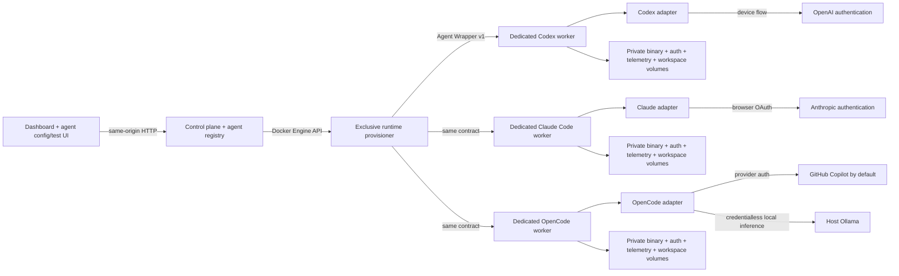

# Agent Dock: containerized subscription-agent POC

This proof of concept registers independently configured agents in a small control plane and connects each one to a vendor-neutral worker API. Every newly managed agent owns an exclusive Codex CLI, Claude Code, or multi-provider OpenCode worker container plus private CLI-binary, authentication, telemetry, and workspace volumes. Each container installs its CLI on first boot and translates provider output into the versioned Agent Wrapper event protocol.

It is meant to validate the architecture—not to automate subscription creation, rotate accounts, resell access, or hide provider usage limits.

## Run it

Requirements: Docker Desktop (or Docker Engine with Compose) and an eligible Codex and/or Claude Code subscription. Ollama is optional and can run on the Docker host without provider credentials.

```bash
cp .env.example .env
# Set a long random WORKER_TOKEN in .env.
docker compose up --build
```

Open [http://localhost:3000](http://localhost:3000). **Codex Worker 01** is the legacy bootstrap runtime and uses OpenAI's device flow. Creating another agent provisions a fresh isolated container. A Claude Code agent uses **Start browser login**; Claude Code may return a one-time authorization code after browser sign-in, which Agent Dock forwards to that agent's waiting CLI process without logging or persisting it. An OpenCode agent defaults to the officially supported GitHub Copilot device flow and automatically selects public GitHub.com before surfacing the provider URL/code. Nothing in this repository asks for or accepts a provider password, session cookie, API key, or stored OAuth token.

When Ollama is listening on the host's default port, the OpenCode worker discovers its models through `host.docker.internal`, generates a private OpenCode provider config in the worker's data volume, and exposes safe model metadata in the agent configuration page. Choose a model under **Instructions → Model policy** and save it to pin that agent. Choose **OpenCode provider default** to keep using the CLI's current provider. The browser-facing API does not return the Ollama endpoint, and Agent Dock never silently falls back between a local model and a subscription provider. Linux Compose uses the `host-gateway` mapping; override `OLLAMA_BASE_URL` if the Ollama service lives elsewhere.

If port 3000 is already occupied, set `CONTROL_PLANE_PORT` in `.env` before starting Compose—for example, `CONTROL_PLANE_PORT=3080` makes the UI available at `http://localhost:3080`.

The first boot of each agent can take a minute because its worker installs its own CLI at runtime. Managed runtimes deliberately do not share writable binary caches or auth homes: each receives four uniquely named volumes for its CLI installation, credentials/config, telemetry, and workspace. The `control-data` volume stores schema-v2 agent definitions and runtime bindings. Set `CODEX_VERSION`, `CLAUDE_VERSION`, or `OPENCODE_VERSION` in `.env` to pin a release.

The worker image includes the operating-system CA certificate bundle required by the Codex CLI for TLS connections during device authentication.

Artifacts created by the three legacy bootstrap workers appear in [`workspace/`](./workspace), [`claude-workspace/`](./claude-workspace), and [`opencode-workspace/`](./opencode-workspace). Newly provisioned agents use exclusive Docker workspace volumes and expose their artifact inventory through the wrapper API.

## What the POC proves



- The browser never receives the Docker socket, worker routing secrets, or provider credentials. In this local POC, the server-side control-plane container uses the Docker socket to provision runtimes; this is a privileged host boundary and must become a constrained provisioner service before multi-user deployment.
- The fleet dashboard supports create, read, update, and lifecycle-aware delete for agent records, then reports each reachable runtime's auth, activity, usage, and request count.
- Newly managed agents cannot share a runtime. The API rejects attaching a runtime that already has an owner.
- Deleting a managed agent explicitly chooses between stopping and retaining all isolated state for later exclusive reattachment, or destroying the container and every private volume after exact-ID confirmation.
- Fleet and agent runtime status refresh every three seconds while the browser tab is visible, with overlapping requests deduplicated.
- Each agent has a durable prompt stored by the control plane and a separate, intentionally ephemeral test conversation.
- The agent workspace puts live runtime, authentication, and usage data in its header, with separate Instructions, Tools & MCP, Data, and Test areas.
- Worker endpoints and bearer tokens are server-side connection details and are never returned in agent API responses or rendered in the browser.
- The browser cannot override durable instructions per request; the control plane injects the saved prompt when it dispatches a task.
- The browser also cannot override a saved model policy per request; model selection is a durable agent setting.
- A worker can be local or remote as long as the control plane can reach its HTTP endpoint.
- Device authentication is initiated by the unmodified Codex CLI and surfaced as a URL/code.
- The card shows safe session metadata, including access-token expiry and last refresh time, without returning credentials to the control plane.
- A user can force Codex's supported managed-session refresh through app-server; this does not run a model turn.
- The adapters convert `codex exec --json`, `claude -p --output-format stream-json`, and `opencode run --format json` output into canonical, vendor-neutral task events.
- The agent can create durable artifacts in its isolated workspace.
- Each completed request records input, cached-input, output, total-token, duration, and outcome metrics in the `agent-data` volume.
- The Codex worker polls app-server after each request for subscription quota windows and account token-activity summaries.
- Claude Code exposes per-request token telemetry in its stream but no supported subscription quota-window endpoint, so that adapter reports quota/account capabilities as unavailable rather than inventing data. An experimental, opt-in source (`CLAUDE_OAUTH_USAGE=1`) can read the CLI's own OAuth token inside the worker and report five-hour and weekly windows from Anthropic's undocumented `/api/oauth/usage` endpoint; it is off by default, labelled experimental in the UI, and fails closed.
- An exhausted subscription and a broken telemetry source are different states. A plan at its limit is a successful reading of 100%; a source that cannot be read is reported with a classified failure reason, keeps the last observed windows, and never renders as 0% used.
- OpenCode exposes per-request token/cost events but account quotas remain provider-specific, so the adapter advertises request telemetry without inventing account windows. OpenCode is a multi-provider harness; it does not itself supply subsidized tokens.
- OpenCode discovers local Ollama models and can explicitly pin one as `ollama/<model>`. The effective model is included in task-start events and request history. Automatic cross-provider fallback is intentionally disabled.
- The control plane depends only on the versioned wrapper contract; both provider workers use the same UI and API surface.

The complete system model is available as [Markdown](./docs/architecture.md), [editable Mermaid](./docs/architecture.mmd), and a [standalone SVG](./docs/architecture.svg). The provider boundary is documented in [`docs/adapter-contract.md`](./docs/adapter-contract.md).

## API

The control plane exposes fleet CRUD plus a consistent set of runtime operations scoped by agent ID:

| Method | Route | Purpose |
|---|---|---|
| `GET` | `/api/v1/health` | Control-plane and worker reachability |
| `GET`, `POST` | `/api/v1/agents` | List or create agent records |
| `GET`, `PATCH`, `DELETE` | `/api/v1/agents/:id` | Read, edit, or delete one agent record |
| `GET` | `/api/v1/runtimes` | List safe runtime identities, lifecycle state, isolation mode, and attachment counts |
| `GET` | `/api/v1/agents/:id/status` | Adapter, capability, auth, task, execution, and usage status |
| `GET` | `/api/v1/agents/:id/providers` | Safe provider-connection health and discoverable model metadata; never credentials or private endpoint URLs |
| `POST` | `/api/v1/agents/:id/auth/login` | Start the adapter's interactive login flow |
| `POST` | `/api/v1/agents/:id/auth/complete` | Forward a provider-issued one-time browser authorization code to a waiting CLI |
| `POST` | `/api/v1/agents/:id/auth/refresh` | Ask the adapter to refresh its managed session |
| `POST` | `/api/v1/agents/:id/tasks` | Run `{ "prompt": "..." }` with saved durable instructions; returns canonical NDJSON |
| `POST` | `/api/v1/agents/:id/tasks/cancel` | Cancel the active task |
| `GET` | `/api/v1/agents/:id/workspace` | List worker artifacts (not their contents) |
| `GET` | `/api/v1/agents/:id/usage` | Read normalized request history, totals, quota windows, and account activity |
| `POST` | `/api/v1/agents/:id/usage/refresh` | Ask the adapter to refresh its available usage sources |

The original unscoped runtime routes remain aliases for the default agent during the POC.

Creation makes runtime ownership explicit:

```json
{
  "name": "Claude Research",
  "adapter": "claude-code",
  "runtime": { "mode": "provision" }
}
```

`runtime.mode: "attach"` requires the ID of an unbound retained runtime and fails with `409` if another agent owns it. Deleting an agent with a runtime requires `{ "runtimeAction": "retain" }` to stop and preserve it, or `{ "runtimeAction": "destroy", "confirmation": "agent-id" }` to permanently remove the container and all four isolated volumes.

Example without the UI:

```bash
curl -N http://localhost:3000/api/v1/agents/worker-01/tasks \
  -H 'content-type: application/json' \
  -d '{"prompt":"Create /workspace/hello.txt with a short greeting."}'
```

## Security boundary and limitations

The worker invokes `codex exec --dangerously-bypass-approvals-and-sandbox` by default because the Docker container is the POC's non-interactive execution boundary. The agent can modify the bind-mounted `workspace/`, run processes inside the worker, and use the worker's network. Do not mount source, SSH keys, cloud credentials, the Docker socket, or sensitive host paths into it. Set `ALLOW_UNSANDBOXED=0` to use Codex's `workspace-write` sandbox instead, understanding that unattended tool execution may be more constrained.

The included Compose file retains one bootstrap worker for each adapter so schema-v1 installations can migrate without losing logins. Those bindings are labeled `shared-legacy`, and the control plane prevents newly created agents from attaching to an already-bound bootstrap runtime. All new managed agents provision an exclusive container and complete private volume set. One-time remote-worker pairing, MCP installation, and arbitrary data mounts remain distinct next capabilities. The Tools & MCP and Data tabs establish those future management surfaces without presenting nonfunctional credential or mount controls.

This prototype deliberately omits multi-tenancy, scheduling, webhooks, queue durability, automatic model fallback, usage-limit routing, TLS, user authentication for the web UI, remote secret management, egress controls, and container resource limits. The control-plane registry is currently a single JSON file and the browser is vanilla JavaScript; SQLite/Postgres-ready persistence and a React/TypeScript frontend are tracked architectural follow-ons. Usage telemetry and agent configuration are durable; jobs, event streams, and test conversations are not.

The experimental Claude usage source is the one place a provider credential is read by Agent Dock code rather than only by the vendor CLI. That read happens inside the worker, against the worker's own private auth volume; the token is never returned, logged, persisted, or sent to the control plane or browser, and only normalized quota windows cross the wrapper. It targets an endpoint Anthropic does not document and for which no third-party OAuth flow or scoped usage-only token exists, so it may break without notice and is disabled unless you set `CLAUDE_OAUTH_USAGE=1`. The account-profile endpoint, which returns names, email addresses, and organization identifiers, is deliberately not called.

The control plane does not inspect or copy provider credentials, but the Docker host administrator can technically inspect container volumes. The CLI needs its auth volume to remain writable so refreshed tokens can be persisted. Each managed runtime has a unique random wrapper bearer token stored only in the server-side registry and its worker environment; it is transport authentication, not a provider credential. Mounting `/var/run/docker.sock` gives the local control plane host-level container authority. For remote deployment, isolate that authority behind a narrowly scoped provisioner, put the UI behind real authentication and TLS, replace stored bearer tokens with secret-manager references or pairing credentials, constrain network egress, run rootless containers, pin the CLI version and base image digest, and add CPU/memory/PID limits.

Users and operators remain responsible for complying with applicable OpenAI terms and account rules. This project does not implement automatic account rollover or subscription provisioning.

## Development and test

The application has no third-party JavaScript dependencies. Run the contract test with:

```bash
npm test
```

To exercise the complete UI without authenticating or spending subscription usage, start the deterministic demo worker:

```bash
npm run demo
```

For UI-only work against a separately running worker:

```bash
WORKER_TOKEN=... WORKER_URL=http://127.0.0.1:7777 npm run dev
```
