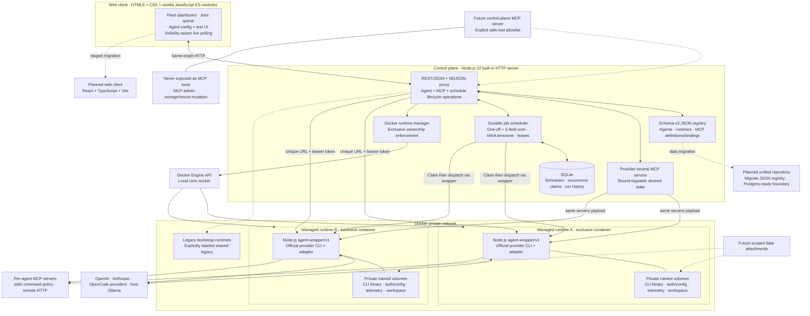

# Agent Dock architecture

Open the rendered [SVG architecture diagram](./architecture.svg), or edit the standalone [Mermaid source](./architecture.mmd).

| Layer | Current stack |
|---|---|
| Browser | Current: semantic HTML5, hand-written CSS, vanilla JavaScript ES modules, Fetch API, fleet and scheduled-job working surfaces, and visibility-aware 3-second polling. Planned: React + TypeScript + Vite after an explicit React/Vue spike. |
| Control plane | Node.js 22, built-in `http` and `node:sqlite`, schema-v3 filesystem-backed JSON registry, durable schedule service, provider-neutral MCP service, streaming Fetch proxy, Docker Engine Unix-socket client |
| Worker wrapper | Node.js 22, built-in `http`, `child_process`, filesystem persistence |
| Provider harnesses | Official `@openai/codex`, `@anthropic-ai/claude-code`, and `opencode-ai` CLI distributions |
| Internal protocol | `agent-wrapper/v1`; REST/JSON for control and NDJSON for task streams |
| Runtime/isolation | Dockerfiles + private network; every managed agent owns an exclusive container, worker identity/token, CLI-binary volume, auth/config volume, telemetry volume, and workspace volume. Concurrent runtime attachment is rejected. A runtime's container can be replaced from the current image while retaining all four volumes, so new worker code does not cost a provider login. Containers are addressed by their stable name rather than their ID, which changes on replacement. |
| Persistence | Current: schema-v3 JSON agent/runtime/MCP registry, SQLite schedule/occurrence/run-history database, and unique Docker named volumes per managed agent. Planned: migrate the JSON registry behind the same Postgres-ready repository boundary. |
| Usage telemetry | Per-request tokens from every adapter; Codex quota windows and account activity via app-server; Claude Code quota windows only through an opt-in experimental OAuth source that is off by default |
| Authentication | Codex device authorization; Claude browser OAuth with an ephemeral, non-persisted completion-code handoff; OpenCode provider auth with GitHub Copilot device authorization as the POC default |
| Tests | Node.js built-in test runner plus live Docker/API/browser smoke tests |

The control plane never parses provider credential files or vendor MCP configuration. Provider-specific commands, auth behavior, event formats, MCP rendering, and supported usage telemetry stop at the adapter boundary. Scheduled jobs are claimed before they are sent through that same wrapper contract, so provider choice does not affect timing or audit semantics. The future control-plane MCP server will intentionally omit MCP administration and storage/mount mutation tools from its code-level tool registry. The local POC mounts the Docker socket into the server-side control plane; production deployment requires a constrained provisioner boundary instead of exposing host-level Docker authority to the web service.
