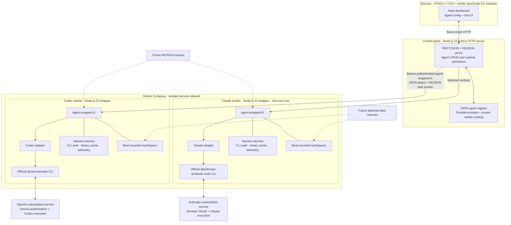

# Agent Dock architecture

| Layer | Current stack |
|---|---|
| Browser | Semantic HTML5, hand-written CSS, vanilla JavaScript ES modules, Fetch API |
| Control plane | Node.js 22, built-in `http`, filesystem-backed JSON registry, streaming Fetch proxy |
| Worker wrapper | Node.js 22, built-in `http`, `child_process`, filesystem persistence |
| Provider harnesses | Official `@openai/codex` and `@anthropic-ai/claude-code` CLI distributions |
| Internal protocol | `agent-wrapper/v1`; REST/JSON for control and NDJSON for task streams |
| Runtime/isolation | Dockerfiles + Docker Compose private network; one process boundary per provider identity |
| Persistence | Docker named volumes for CLI auth, installed binaries, request telemetry, and registry; host bind mounts for workspaces |
| Authentication | Codex device authorization; Claude browser OAuth with an ephemeral, non-persisted completion-code handoff |
| Tests | Node.js built-in test runner plus live Docker/API/browser smoke tests |

The control plane never parses provider credential files. Provider-specific commands, auth behavior, event formats, and supported usage telemetry stop at the adapter boundary.
