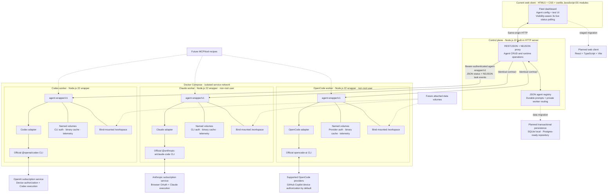

# Agent Dock architecture

Open the rendered [SVG architecture diagram](./architecture.svg), or edit the standalone [Mermaid source](./architecture.mmd).

| Layer | Current stack |
|---|---|
| Browser | Current: semantic HTML5, hand-written CSS, vanilla JavaScript ES modules, Fetch API, visibility-aware 3-second status polling. Planned: React + TypeScript + Vite after an explicit React/Vue spike. |
| Control plane | Node.js 22, built-in `http`, filesystem-backed JSON registry, streaming Fetch proxy |
| Worker wrapper | Node.js 22, built-in `http`, `child_process`, filesystem persistence |
| Provider harnesses | Official `@openai/codex`, `@anthropic-ai/claude-code`, and `opencode-ai` CLI distributions |
| Internal protocol | `agent-wrapper/v1`; REST/JSON for control and NDJSON for task streams |
| Runtime/isolation | Dockerfiles + Docker Compose private network; one process boundary per provider identity |
| Persistence | Current: JSON registry plus Docker named volumes for CLI auth, installed binaries, and request telemetry. Planned: SQLite locally behind a Postgres-ready repository boundary. |
| Authentication | Codex device authorization; Claude browser OAuth with an ephemeral, non-persisted completion-code handoff; OpenCode provider auth with GitHub Copilot device authorization as the POC default |
| Tests | Node.js built-in test runner plus live Docker/API/browser smoke tests |

The control plane never parses provider credential files. Provider-specific commands, auth behavior, event formats, and supported usage telemetry stop at the adapter boundary.
